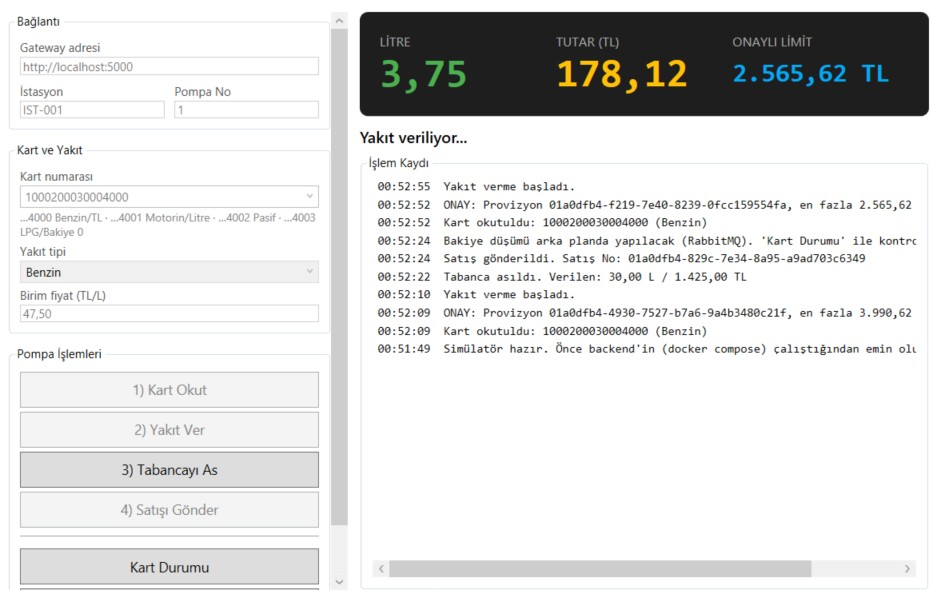
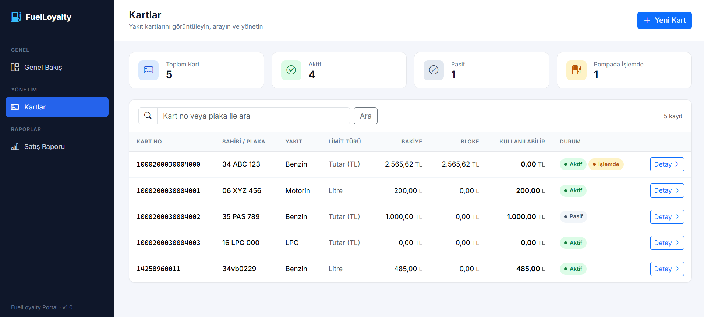
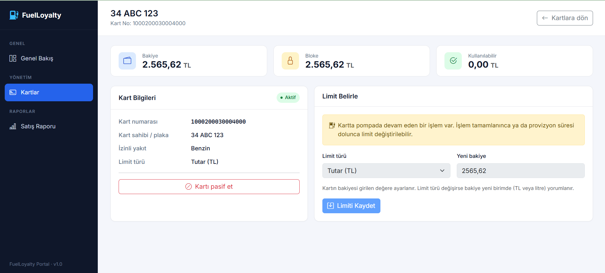
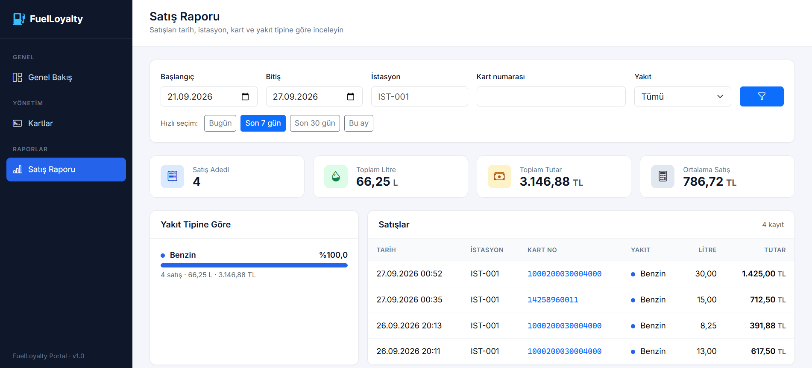
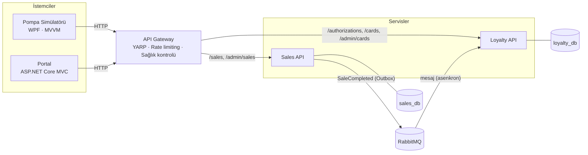
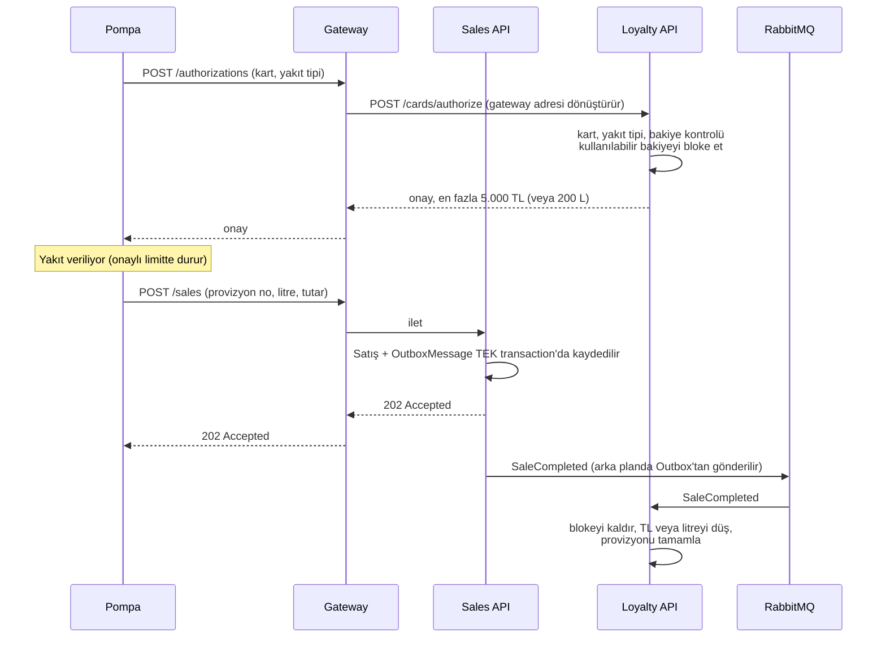

# FuelLoyalty

**.NET 9 mikroservis mimarisiyle geliştirilmiş akaryakıt kartı onay ve bakiye yönetim sistemi.**

Akaryakıt istasyonları için filo / sadakat kartı sistemi. Pompada kart okutulduğunda kart, yakıt tipi ve bakiye kontrol edilir, kullanılabilir bakiye bloke edilir (provizyon) ve pompa onaylı limite kadar (**TL** veya **litre**) yakıt verir. Satış bitince gerçekte kullanılan miktar bakiyeden düşülür.

Projede bir WPF pompa simülatörü ve kart yönetimi / satış raporlama için bir web portalı da bulunuyor.


---

## Ekran Görüntüleri

| Pompa Simülatörü (WPF) | Portal – Kartlar |
|---|---|
|  |  |

| Portal – Kart Detay | Portal – Satış Raporu |
|---|---|
|  |  |

---

## Mimari



| Bileşen | Görevi |
|---|---|
| **Loyalty API** | Pompaya kart onayı verir. Kartlar, limitler (TL veya litre), provizyonlar, bakiyeden düşüm, süresi dolan provizyonların kapatılması |
| **Sales API** | Satışları kaydeder, satış raporunu sunar ve `SaleCompleted` mesajını yayınlar. Loyalty'yi doğrudan çağırmaz, sadece mesaj gönderir |
| **API Gateway** | Dışarıya açık tek kapı. Yönlendirme ve adres dönüştürme, pompa trafiği için istek sınırlama, servislerin sağlık yoklaması |
| **Pompa Simülatörü** | Gerçek pompa gibi çalışan masaüstü uygulama: kart okut → yakıt ver (limitte otomatik durur) → satışı gönder |
| **Portal** | Kart yönetimi (ekleme, limit belirleme, aktif/pasif) ve satış raporları |

### İş akışı



---

## Teknik Kararlar

| Karar | Neden |
|---|---|
| **Onay için senkron HTTP, düşüm için asenkron mesaj** | Pompa, yakıt vermeden önce onayı beklemek zorunda, bu yüzden onay istek-cevap şeklinde ve doğrudan Loyalty'den alınır. Bakiye düşümü birkaç saniye sonra olabilir. Loyalty servisi kapalı olsa bile mesaj kuyrukta bekler, kaybolmaz. |
| **Servisler birbirini doğrudan çağırmaz** | İlk tasarımda onay isteği satış servisi üzerinden Loyalty'ye gidiyordu. Satış servisi orada sadece aracılık yapıyor ve iki servis arasında gereksiz bir senkron bağımlılık oluşturuyordu. Yönlendirme gateway'e taşındı. Artık Sales ile Loyalty sadece RabbitMQ üzerinden haberleşiyor; Loyalty kapalıyken Sales satış almaya devam ediyor. |
| **Servis adı sahip olduğu işi anlatır** | Onay işi gateway'e taşınınca bu servisin tek sorumluluğu satışlar oldu. Bu yüzden adı `Transaction` yerine `Sales` yapıldı. "Transaction" kelimesi veritabanı transaction'ı ile de karışabiliyordu. |
| **Provizyon (bloke)** | Kart okutulunca kullanılabilir bakiyenin tamamı bloke edilir. Aynı kart ikinci bir pompada okutulursa "kullanılabilir bakiye yok" cevabı alır, kart aynı anda iki yerde kullanılamaz. Satış gelmezse bloke, arka plan görevi tarafından süre sonunda kaldırılır. |
| **Optimistic concurrency** | PostgreSQL'in `xmin` kolonu satır sürümü olarak kullanılır. Aynı kart üzerinde aynı anda yapılan işlemler (onay, düşüm, zaman aşımı, limit değişikliği) birbirinin üzerine sessizce yazamaz. Kaybeden işlem tekrar denenir ya da reddedilir. |
| **Transactional Outbox** | Satış kaydı ve `SaleCompleted` mesajı aynı veritabanı transaction'ında kaydedilir. RabbitMQ kapalı olsa bile "satış kaydedildi ama bakiye düşmedi" ya da "bakiye düştü ama satış kaydı yok" durumu oluşmaz. |
| **Üç seviyede idempotency (tekrar güvenliği)** | Aynı provizyonla gelen ikinci satış yeni kayıt açmaz (unique index + PostgreSQL `23505` hatasının yakalanması). Aynı `SaleCompleted` mesajı iki kez gelirse provizyonun durumu sayesinde ikincisi atlanır. Tekrar denemeler bakiyeyi iki kez düşmez. |
| **Vertical Slice Architecture** | Servisler küçük olduğu için kod teknik katmanlara değil özelliklere göre gruplandı (endpoint + handler + validator aynı klasörde). Yeni özellik eklemek yeni bir klasör açmak demek. Endpoint'ler ve handler'lar otomatik bulunduğu için `Program.cs` değişmez. |
| **Zengin domain modeli** | `Card` ve `CardAuthorization` sınıfları davranış sunar (`Authorize`, `SettleAuthorization`, `ExpireAuthorization`, `SetLimit`), alanları dışarıdan değiştirilemez. İş kuralları atlanamaz. |
| **Result pattern + ProblemDetails** | Beklenen hatalar (pasif kart, bulunamadı, çakışma) exception değil, hata kodu taşıyan dönüş değerleri. API'lerde standart ProblemDetails (RFC 7807) formatına, istemcilerde tekrar aynı hata koduna çevrilir. |
| **Her servisin kendi veritabanı** | Loyalty ve Sales ayrı veritabanları kullanır (`loyalty_db`, `sales_db`). Bir servis diğerinin tablolarına erişmez. |
| **Hazır olma kontrolü RabbitMQ'yu içermez** | `/health/ready` sadece veritabanını kontrol eder. RabbitMQ kesintisi Outbox sayesinde tolere edildiği için servisi devre dışı bırakmamalı. Tüm bağlantıların durumu `/health` adresinde görülebilir. |
| **Gateway tek giriş kapısı** | Pompalar ve portal servislerin iç adreslerini bilmez. `POST /authorizations` isteği gateway'de Loyalty'nin `/cards/authorize` adresine çevrilir; iç adres değişse bile istemciler etkilenmez. Docker'da servis portları dışarıya açılmaz. |
| **MediatR, FluentAssertions ve MassTransit v9 kullanılmadı** | Bu kütüphaneler ticari lisansa geçti. Handler'lar doğrudan DI ile çözülür, MassTransit'in açık kaynak 8.x sürümü kullanılır. |
| **UTC kayıt, ekranda Türkiye saati** | Tüm zamanlar UTC olarak saklanır. Portal, rapor filtrelerini ve gösterilen saatleri sunucunun saat diliminden bağımsız olarak `Europe/Istanbul`'a göre çevirir. |
| **`TimeProvider` kullanımı** | Zamana bağlı kurallar (provizyon süresi, raporlardaki "bugün") doğrudan `DateTime.Now` çağırmaz, sahte bir saatle test edilebilir. |

---

## Kullanılan Teknolojiler

| Alan | Teknolojiler |
|---|---|
| Backend | .NET 9, ASP.NET Core Minimal API, EF Core 9, FluentValidation |
| Mesajlaşma | RabbitMQ, MassTransit 8 (EF Core Outbox, retry) |
| Veritabanı | PostgreSQL 16 (Npgsql) |
| Gateway | YARP (yönlendirme, rate limiting, aktif sağlık kontrolü) |
| Portal | ASP.NET Core MVC, Bootstrap 5 |
| Masaüstü | WPF, CommunityToolkit.Mvvm, Microsoft.Extensions.DependencyInjection |
| Test ve CI | xUnit, GitHub Actions |
| Altyapı | Docker, Docker Compose, health check'ler |

---

## Kurulum

### Gereksinimler

- [Docker Desktop](https://www.docker.com/products/docker-desktop/)
- [.NET 9 SDK](https://dotnet.microsoft.com/download) ve Windows (sadece WPF pompa simülatörü için)

### Çalıştırma

```bash
git clone https://github.com/islerfirat/FuelLoyalty.git
cd FuelLoyalty
docker compose up -d --build
```

İlk derleme birkaç dakika sürebilir. `docker compose ps` komutunda servisler `healthy` görününce:

| Adres | Ne |
|---|---|
| http://localhost:5100 | **Portal** |
| http://localhost:5000 | **API Gateway** (simülatör bu adresi kullanır) |
| http://localhost:15672 | RabbitMQ yönetim paneli (`guest` / `guest`) |
| http://localhost:5050 | pgAdmin (`admin@example.com` / `admin123`, sunucu adresi: `postgres`) |

### Pompa simülatörü

```bash
dotnet run --project src/FuelLoyalty.PumpSimulator
```

Ya da `FuelLoyalty.sln` dosyasını Visual Studio'da açıp `FuelLoyalty.PumpSimulator` projesini başlatın.

### Test kartları

| Kart numarası | Plaka | Yakıt | Limit | Senaryo |
|---|---|---|---|---|
| `1000200030004000` | 34 ABC 123 | Benzin | 5.000 TL | Tutar limitli kart |
| `1000200030004001` | 06 XYZ 456 | Motorin | 200 L | Litre limitli kart |
| `1000200030004002` | 35 PAS 789 | Benzin | 1.000 TL | Pasif kart |
| `1000200030004003` | 16 LPG 000 | LPG | 0 TL | Bakiyesi olmayan kart |

---

## Denenebilecek Senaryolar

| Senaryo | Nasıl | Beklenen |
|---|---|---|
| Limitte otomatik durma | Litre limitli kart (`…4001`) ile yakıt vermeye başlayın ve bekleyin | Pompa tam 200 L'de durur |
| Aynı kart, iki pompa | İki simülatör açın (pompa 1 ve 2), ikisinde de `…4000` okutun | İkinci pompa: "Kullanılabilir bakiye yok" |
| Loyalty kapalı | `docker stop fuelloyalty-loyalty-api`, satış gönderin, sonra tekrar başlatın | Yeni onay verilemez, ama Sales satışı kabul eder. Mesaj kuyrukta bekler, Loyalty açılınca bakiye düşer |
| RabbitMQ kapalı | `docker stop fuelloyalty-rabbitmq`, satışı tamamlayın, sonra tekrar başlatın | Satış kabul edilir (202), `OutboxMessage` tablosunda bekler, RabbitMQ açılınca gönderilir |
| Veritabanı kapalı | `docker stop fuelloyalty-postgres` | Servisler `unhealthy` olur, gateway 503 döner, veritabanı açılınca her şey kendiliğinden toparlanır |
| Yakıt alınmadı | Kartı okutun, yakıt vermeyin | Bloke, provizyon süresi dolunca kalkar |
| İstek sınırı | Kısa sürede çok sayıda `/authorizations` isteği gönderin | Gateway 429 döner |

---

## API (gateway üzerinden)

| Metot | Adres | Açıklama |
|---|---|---|
| `POST` | `/authorizations` | Pompada kart okutuldu: onay ve bloke (gateway, Loyalty'nin `/cards/authorize` adresine yönlendirir) |
| `POST` | `/sales` | Satış bitti: kaydet ve `SaleCompleted` yayınla |
| `GET` | `/cards/{cardNumber}` | Kart durumu |
| `GET` | `/admin/cards?search=` | Kartları listele / ara |
| `POST` | `/admin/cards` | Yeni kart |
| `PUT` | `/admin/cards/{cardNumber}/limit` | Limit türü ve bakiye belirle |
| `PUT` | `/admin/cards/{cardNumber}/status` | Aktif / pasif yap |
| `GET` | `/admin/sales?from=&to=&stationCode=&cardNumber=&fuelType=` | Satış raporu ve yakıt tipine göre toplamlar |

Sadece iç ağdan erişilebilenler (gateway yönlendirmez): `/health`, `/health/live`, `/health/ready`.

---

## Proje Yapısı

```
src/
├── FuelLoyalty.Contracts           Servisler arası sözleşmeler ve mesajlar
├── FuelLoyalty.SharedKernel        Result, Error
├── FuelLoyalty.ServiceDefaults     Endpoint/handler keşfi, doğrulama filtresi, ProblemDetails,
│                                   RabbitMQ kurulumu, health check'ler
├── FuelLoyalty.Loyalty.Api         Domain/  Features/  Infrastructure/
├── FuelLoyalty.Sales.Api           Domain/  Features/  Infrastructure/
├── FuelLoyalty.Gateway             YARP ayarları
├── FuelLoyalty.PumpSimulator       WPF · MVVM
└── FuelLoyalty.Portal              ASP.NET Core MVC
```

Örnek bir özellik klasörü (`Loyalty.Api/Features/AuthorizeCard`):

```
AuthorizeCardEndpoint.cs     Sadece HTTP: adresi tanımlar, doğrulamayı uygular
AuthorizeCardValidator.cs    FluentValidation kuralları
AuthorizeCardHandler.cs      İş akışı: kartı yükle, domain'i çağır, kaydet
```

---

## Yol Haritası

- [ ] Kimlik doğrulama ve rol bazlı yetkilendirme (gateway'de JWT; Yönetici, Raporlama, İstasyon gibi roller)
- [ ] Testcontainers ile entegrasyon testleri
- [ ] İzlenebilirlik: OpenTelemetry ve merkezi loglama (Seq)
- [ ] Dönemsel limitler (örneğin her ay sıfırlanan aylık limit)
- [ ] Rapor dışa aktarma (Excel / CSV) ve büyük sonuçlar için sayfalama
- [ ] Kubernetes

---

## Geliştirici

**Fırat İşler** · .NET Developer

- GitHub: [@islerfirat](https://github.com/islerfirat)
- LinkedIn: [linkedin.com/in/firatisler](https://www.linkedin.com/in/firatisler)

## Lisans

Bu proje [MIT lisansı](LICENSE) ile lisanslanmıştır.
